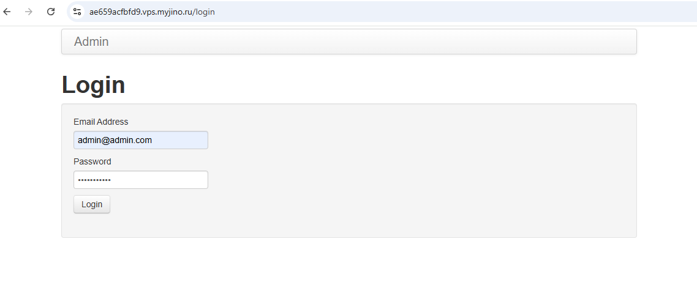
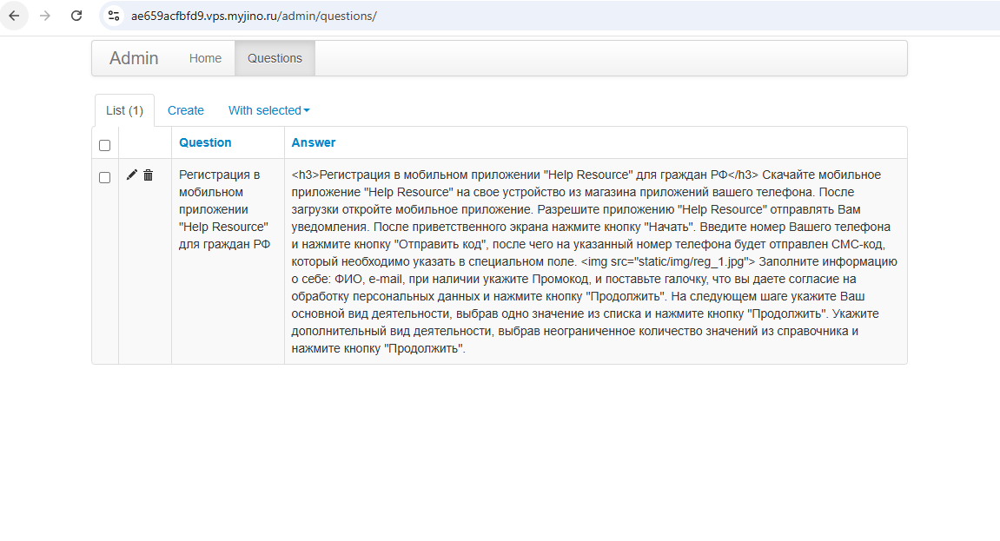
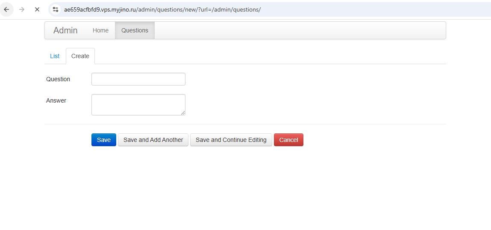
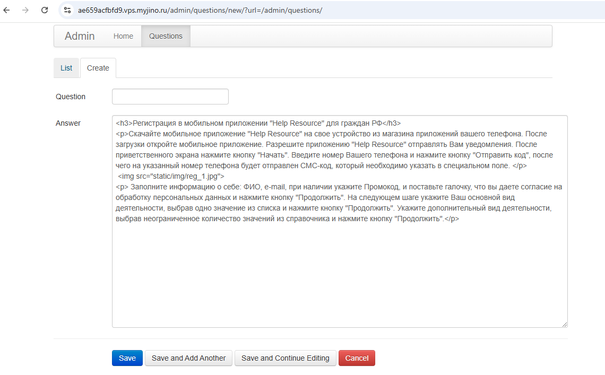
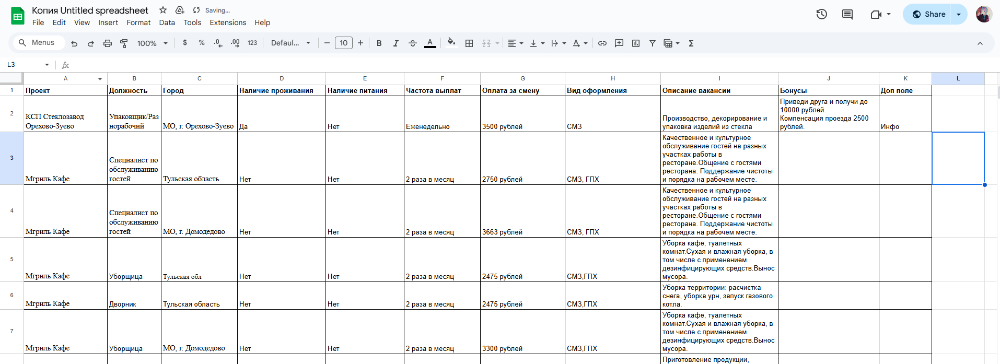

# Инструкция

## Содержание
- [Установка](#установка)
- [Настройка конфига](#настройка-конфига)
- [Включение, перезагрузка, выключени](#включение-перезагрузка-выключение)
- [Админ панель](#админ-панель)
- [Заполнение таблицы](#заполнение-таблицы)
- [UTM-метки](#utm-метки)

## Установка

```bash
sudo apt install python-pip
pip install -r requirements.txt
sudo apt install supervisor
```
- Скопировать папку hr_telegram в /home
- Скопировать hr.conf и hr_bot.conf в /etc/supervisor/conf.d/

## Настройка конфига

```json
// /home/hr_telegram/config.json
{
    "token": "...", // телеграм токен бота
    "table_token": "1Ipes4Wvw0uBlUMCx_vPnFw10DQdP6WaPxUtEPxUdIuc", // токен гугл-таблицы (берется из ссылки на таблицу в открытом доступе (https://docs.google.com/spreadsheets/d/1Ipes4Wvw0uBlUMCx_vPnFw10DQdP6WaPxUtEPxUdIuc/edit?gid=0#gid=0))
    "bx24url": "...", // ссылка на bitrix api
    "cert_path": "cert.pem", // путь к файлу сертификатов
    "key_path": "key.pem", // путь к файлу сертификатов
    
    "email": "admin@admin.com", // почта для входа в админ панель
    "password": "...", // пароль для входа в админ панель
    
    "tg_message": "Добро пожаловать в HelpResource!", // сообщение при запуске бота
    "url": "https://ae659acfbfd9.vps.myjino.ru/", // ссылка на страницу webapp

    // Настройка контактов
    "phone": "8 (800) 700-95-77",
    "client_email": "mail@helpresource.ru",
    "provider_email": "kp@helpresource.ru",
    "schedule": "ПН-ПТ с 9:00 до 18:00",
    "address": "111524 г. Москва, ул. Электродная, д. 2, стр. 12-13-14, оф. №32"
}
```

После изменения конфига необходимо перезагрузить проект

## Включение, перезагрузка, выключение

```bash
sudo service supervisor start
```
```
sudo service supervisor restart
```
```
sudo service supervisor stop
```

## Админ панель

Пример ссылки на админ панель - `https://<webapp_url>/admin`



Чтобы войти нужно ввести почту и пароль указанный в конфиге, сессия активна 10 мин, после нужно заново войти.



Далее на вкладке Questions можно увидеть статьи доступные в WebApp. Их можно добавлять, менятть и удалять.

Рассмотрим пример добавления



После нажатия кнопки Create открывается страница добавления. 

Поле Question - Заголовок статьи, который отображается в списке.

Поле Answer - Сама статья после открытия <br>
В это поле можно писать обычный текст и можно использовать HTML
### Список тэгов

```html
<p>Блок текста (Абзац)</p>
<p align="center">Блок текста (Абзац)</p> - по центру
<p align="left">Блок текста (Абзац)</p> - по левому краю
<p align="right">Блок текста (Абзац)</p> - по правому краю
<p align="justify">Блок текста (Абзац)</p> - по ширине
<br> - перевод на новую строку
```
```html
<h1>Заголовок 1 уровня (самый крупный)</h1>
<h2>Заголовок 2 уровня</h2>
<h3>Заголовок 3 уровня</h3>
<h4>Заголовок 4 уровня</h4>
<h5>Заголовок 5 уровня</h5>
```
```html
<a href="ссылка">Любой текст после нажатия на который будет открываться ссылка</a>
```
```html
<b>Жирный текст</b>
<i>Курсив</i>
<u>Подчеркнутый</u>
<s>Зачёркнутый</s>
```

Тэги могут быть вложенными, например
```html
<p><b>HTML</b> - <i>язык гипертекстовой разметки<i></p>
```

#### Вставка изображений
```html

```
либо можно предварительно загрузить изображение в папку hr_telegram/static/img
```html

```

<br>

**Для удобства рекомендую сайт https://editorhtmlonline.com/ru/**<br>

___
<br>



После того как текст готов его нужно вставить в поле Answer, поле можно увеличить потянув за правый нижний угол. И нажать Save.

## Заполнение таблицы



Таблица должна быть доступна по ссылке. 

Она обязательно должна содержать заполненные поля
- **Проект**
- **Должность**
- **Город**
- **Наличие проживания**
- **Наличие питания**
- **Частота выплат**
- **Оплата за смену**

Также можно добавлять дополнительные поля, они будут отображаться в карточке вакансии

!!! **Все поля должны быть в формате строки, так как например числовой вызывает ошибки**

## UTM-метки

Для первоначального ознакомления - https://habr.com/ru/companies/click/articles/478758/

Так как в Telegram WebApp по умолчанию не поддерживаются UTM-метки был придуман особый способ задания данных этих меток.

При переходе в WebApp по ссылке можно указывать параметр - `startapp`, метки передаются в него.

Для передачи нужно сформировать строку состоящую из параметров UTM-меток, где `__` - разделитель, вместо `&`. 

```
utm_source=some_source__utm_medium=some_medium__utm_campaign=some_campaign__utm_term=some_term__utm_content=some_content
```

Окончательный вариант ссылки выглядит так.

```
https://t.me/help_resource_bot?startapp=utm_source=some_source__utm_medium=some_medium__utm_campaign=some_campaign__utm_term=some_term__utm_content=some_content
```

P.S. В примере представлены все параметры UTM-меток. Указание всех параметров не является обязательным.